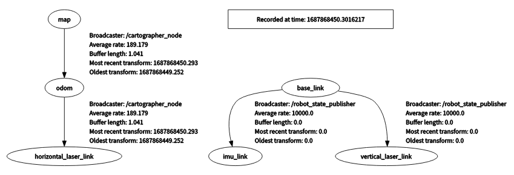
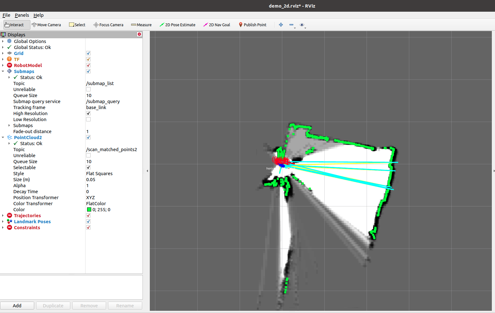
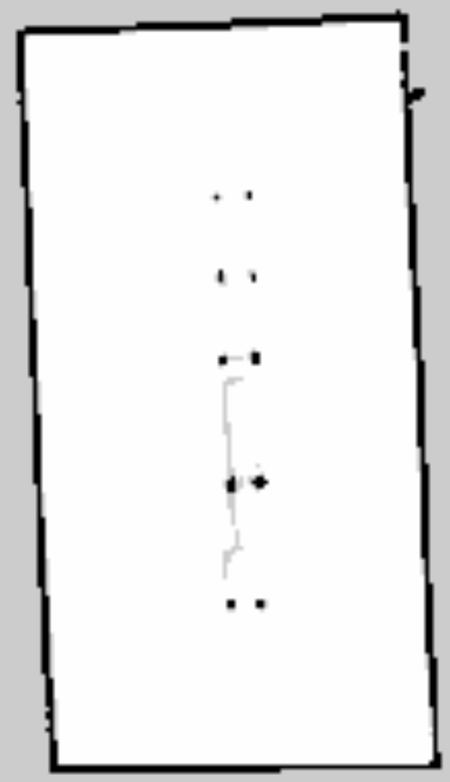

# 主要是写一下cartographer在ubuntu20.04中的安装以及使用
1. 使用李太白的教程<Cartographer从入门到精通_ 原理深剖+源码逐行讲解【课件】>
2. 下载安装包，安装包下载之后，**需要修改auto-carto-build.sh中的：python-wstool、python-rosdep、python-sphinx改为python3-wstool、python3-rosdep、python3-sphinx**，这是因为Ubuntu20.04里面没有python了用的都是python3，并打开终端输入sudo chmod +x auto-carto-build.sh，赋予.sh文件权限
3. 在执行完以上步骤之后运行.sh文件，这里面说几个坑的地方，如果是新的系统，建议事先安装Cartographer，因为Carto已经停止维护，所以
# **重点：每次修改cartographer的参数之后，一定要进行编译(运行./catkin_make.sh)，否则参数无法生效**
## 介绍一下Cartographer源码和实际激光雷达的连接，**重点：这种更改方法(把tracking_frame和published_frame改成"laser")会导致激光雷达脱离底盘，即没有base_link，效果如图**，如果说按照实际情况跑，即雷达安装在底盘上需要考虑base_link，那么(把tracking_frame和published_frame保持为"base_link")即可，记得修改/cartographer_ros/urdf/backpack_2d.urdf文件中laser和base_link的坐标变换消息:
1. 修改cartographer_ros/configuration_files/revo_lds.lua文件,该文件的形式相当于yaml参数文件:
```c++
include "map_builder.lua"
include "trajectory_builder.lua"

options = {
  map_builder = MAP_BUILDER,
  trajectory_builder = TRAJECTORY_BUILDER,
  map_frame = "map",
  -- 跟踪和发布的frame都改称雷达的frameID
  tracking_frame = "laser",
  published_frame = "laser",
  -- tracking_frame = "base_link",
  -- published_frame = "base_link",  
  odom_frame = "odom",
-- true改为false，不用提供里程计数据
  provide_odom_frame = true,
-- false改为true，仅发布2D位资
  publish_frame_projected_to_2d = false,
  use_pose_extrapolator = true,
-- true改为false，不使用里程计数据
  use_odometry = false,
  use_nav_sat = false,
  use_landmarks = false,
-- 0改为1,使用一个雷达
  num_laser_scans = 1,
-- 1改为0，不使用多波雷达
  num_multi_echo_laser_scans = 0,
  -- 10改为1，1/1=1等于不分割
  num_subdivisions_per_laser_scan = 1,
  num_point_clouds = 0,
  lookup_transform_timeout_sec = 0.2,
  submap_publish_period_sec = 0.3,
  pose_publish_period_sec = 5e-3,
  trajectory_publish_period_sec = 30e-3,
  rangefinder_sampling_ratio = 1.,
  odometry_sampling_ratio = 1.,
  fixed_frame_pose_sampling_ratio = 1.,
  imu_sampling_ratio = 1.,
  landmarks_sampling_ratio = 1.,
}
-- 是否启动2D SLAM
MAP_BUILDER.use_trajectory_builder_2d = true
TRAJECTORY_BUILDER_2D.submaps.num_range_data = 35
-- 比机器人半径小的都忽略
TRAJECTORY_BUILDER_2D.min_range = 0.3
-- 限制在雷达最大扫描范围内，越小一般越精确些
TRAJECTORY_BUILDER_2D.max_range = 8.
-- 传感器数据超出有效范围最大值
TRAJECTORY_BUILDER_2D.missing_data_ray_length = 1.
-- true改成false,不使用IMU数据，大家可以开启，然后对比下效果
TRAJECTORY_BUILDER_2D.use_imu_data = false
-- false改成true,使用实时回环检测来进行前端的扫描匹配
TRAJECTORY_BUILDER_2D.use_online_correlative_scan_matching = true

TRAJECTORY_BUILDER_2D.real_time_correlative_scan_matcher.linear_search_window = 0.1
TRAJECTORY_BUILDER_2D.real_time_correlative_scan_matcher.translation_delta_cost_weight = 10.
TRAJECTORY_BUILDER_2D.real_time_correlative_scan_matcher.rotation_delta_cost_weight = 1e-1

POSE_GRAPH.optimization_problem.huber_scale = 1e2
-- 设置0可关闭全局SLAM
POSE_GRAPH.optimize_every_n_nodes = 35
-- Fast csm的最低分数，高于此分数才进行优化。
POSE_GRAPH.constraint_builder.min_score = 0.65

return options
```
2. 修改cartographer_ros/launch/demo_revo_lds.launch文件参数
```c++
<launch>
<!-- 如果接入自己的雷达这里要设定成false 仿真用true -->
  <param name="/use_sim_time" value="false" />
  <!------------------------------------------->
  <!这段相当于加载实际的机器人模型,这部分是carto中原来没有的,这里我们用carto中自带的urdf文件>
  <param name="robot_description"
    textfile="$(find cartographer_ros)/urdf/backpack_2d.urdf" />
  <node name="robot_state_publisher" pkg="robot_state_publisher"
    type="robot_state_publisher" />
  <!------------------------------------------->
  
  <node name="cartographer_node" pkg="cartographer_ros"
      type="cartographer_node" args="
          -configuration_directory $(find cartographer_ros)/configuration_files
          -configuration_basename revo_lds.lua"
      output="screen">
    <remap from="scan" to="scan" />
  </node>

  <node name="cartographer_occupancy_grid_node" pkg="cartographer_ros"
      type="cartographer_occupancy_grid_node" args="-resolution 0.1" />

  <node name="rviz" pkg="rviz" type="rviz" required="true"
      args="-d $(find cartographer_ros)/configuration_files/demo_2d.rviz" />
  
  // 不跑数据集必须注释掉
  <!-- clocl前面是两个- -->
  <!-- 
  <node name="playbag" pkg="rosbag" type="play"
      args="-clock $(arg bag_filename)" />
  -->

</launch>
```
3. 需要自己写一个节点,因为激光雷达发布的话题是"scan",并且link或者说frame_id是"laser",对于carto来说无法进行坐标变换会出现问题,这个功能节点写到了**read_laser_data**功能包下,laser_carto_node.cpp
```c++
// 主要是接收原始雷达的话题简单修改以下并发布
// 话题发布
cartoLaserTopic = node_handle_.advertise<sensor_msgs::LaserScan>("scan",1);

// 回调函数
void LaserScan::ScanCallback(const sensor_msgs::LaserScan::ConstPtr &scan_msg)
{
  cartoLaserData = *scan_msg;
  cartoLaserData.header.frame_id = "laser";
  cartoLaserTopic.publish(cartoLaserData);
}
```
做完以上工作之后,按照顺序启动以下节点:
a.roslaunch read_laser_data laser_change_param.launch //用来启动激光雷达和更改相应的雷达参数
b.roslaunch read_laser_data laser_carto.launch        //用来转换雷达的消息
c.在carto的工作空间下: roslaunch cartographer_ros demo_revo_lds.launch  //启动carto
成功的话

## Cartographer调参
Cartographer可以说是二维激光雷达SLAM算法的天花板了，而且本工程的重点在于规划，所以这里面不对源码进行修改，只对参数进行调整，这里有个[slam建图与定位_cartographer代码阅读(1)_框架理解和node_main](https://blog.csdn.net/qq_51108184/article/details/130737244?spm=1001.2014.3001.5501)，讲了怎么调参以及初步对代码的理解
这里根据该帖子简单整理一下内容：
1. **node_main.cc**，文件位置/cartographer_ros/cartographer_ros/cartographer_ros/node_main.cc:
```c++
// collect_metrics ：激活运行时度量的集合.如果激活, 可以通过ROS服务访问度量
DEFINE_bool(collect_metrics, false,
            "Activates the collection of runtime metrics. If activated, the "
            "metrics can be accessed via a ROS service.");
//文件夹            
DEFINE_string(configuration_directory, "",
              "First directory in which configuration files are searched, "
              "second is always the Cartographer installation to allow "
              "including files from there.");
//lua文件
DEFINE_string(configuration_basename, "",
              "Basename, i.e. not containing any directory prefix, of the "
              "configuration file.");
//stream读取，地图文件
DEFINE_string(load_state_filename, "",
              "If non-empty, filename of a .pbstream file to load, containing "
              "a saved SLAM state.");
// 标志位 是否将保存的状态家在为冻结(非优化)轨迹
DEFINE_bool(load_frozen_state, true,
            "Load the saved state as frozen (non-optimized) trajectories.");
// 是否立即启动具有默认主题的第一个轨迹
DEFINE_bool(
    start_trajectory_with_default_topics, true,
    "Enable to immediately start the first trajectory with default topics.");
// 如果不是空的，是否在关闭之前序列化状态并将其写入磁盘
DEFINE_string(
    save_state_filename, "",
    "If non-empty, serialize state and write it to disk before shutting down.");
```
以下部分代码是**重点：在跑通Cartographer之前，千万千万不要安装任何形式的gflags和glog库，千万千万千万不要安装，就是遵循刚装完的系统，在安装完ROS之后能使用键盘控制小乌龟移动之后，直接安装Carto，不要有其它任何操作，这是两天装了3次系统的教训**，装了三次系统就是因为Carto用的glog和gflags和使用命令行克隆源码安装的版本不一样，就算版本一样也可能出问题，因为Carto用的这两个库比较特殊
```c++
// note: 初始化glog库
google::InitGoogleLogging(argv[0]);

// 使用gflags进行参数的初始化. 其中第三个参数为remove_flag
// 如果为true, gflags会移除parse过的参数, 否则gflags就会保留这些参数, 但可能会对参数顺序进行调整.
google::ParseCommandLineFlags(&argc, &argv, true);
```
```c++
/**
 * @brief glog里提供的CHECK系列的宏, 检测某个表达式是否为真
 * 检测expression如果不为真, 则打印后面的description和栈上的信息
 * 然后退出程序, 出错后的处理过程和FATAL比较像.
 */
// 对文件目录和文件进行检查，没有文件就退出程序
CHECK(!FLAGS_configuration_directory.empty())
    << "-configuration_directory is missing.";
CHECK(!FLAGS_configuration_basename.empty())
    << "-configuration_basename is missing.";

// tf监听，用于监听坐标变换
constexpr double kTfBufferCacheTimeInSeconds = 10.;
tf2_ros::Buffer tf_buffer{::ros::Duration(kTfBufferCacheTimeInSeconds)};
// 开启监听tf的独立线程
tf2_ros::TransformListener tf(tf_buffer);

// 创建从配置文件对接接口的结构体
NodeOptions node_options;
TrajectoryOptions trajectory_options

// 从lua配置文件中读取，给node_options, trajectory_options 赋值
std::tie(node_options, trajectory_options) =
    LoadOptions(FLAGS_configuration_directory, FLAGS_configuration_basename);

// slam算法类 包含前端 后端
auto map_builder =
cartographer::mapping::CreateMapBuilder(node_options.map_builder_options);

// pbstream的使用
  // 如果加载了pbstream文件, 就执行这个函数
  if (!FLAGS_load_state_filename.empty()) {
    node.LoadState(FLAGS_load_state_filename, FLAGS_load_frozen_state);
  }

// 添加轨迹
// 使用默认topic 开始轨迹
if (FLAGS_start_trajectory_with_default_topics) {
  node.StartTrajectoryWithDefaultTopics(trajectory_options);
}

// 程序结束操作
//代码执行这一句就不往下执行了,下边的是程序结束后执行的代码
::ros::spin();

// 结束所有处于活动状态的轨迹
node.FinishAllTrajectories();

// 当所有的轨迹结束时, 再执行一次全局优化
node.RunFinalOptimization();

// 如果save_state_filename非空, 就保存pbstream文件
if (!FLAGS_save_state_filename.empty()) {
  node.SerializeState(FLAGS_save_state_filename,
                      true /* include_unfinished_submaps */);
}
```

2. 参数调优文件,有五个文件,主要使用2d的配置文件,有四个,路径/cartographer/configuration_files/
前端:**trajectory_builder.lua  trajectory_builder_2d.lua**
后端:**map_builder.lua  pose_graph.lua**
**trajectory_builder.lua**:
```c++
TRAJECTORY_BUILDER = {
  trajectory_builder_2d = TRAJECTORY_BUILDER_2D,--2d轨迹赋值
  trajectory_builder_3d = TRAJECTORY_BUILDER_3D,--
--  pure_localization_trimmer = {
--    max_submaps_to_keep = 3,
--  },
  collate_fixed_frame = true,  --是否通过固定帧修正
  collate_landmarks = false, --是否通过反光板修正
}
```
**trajectory_builder_2d.lua**
```c++
TRAJECTORY_BUILDER_2D = {
  use_imu_data = true,            -- 是否使用imu数据
  min_range = 0.,                 -- 雷达数据的最远最近滤波, 保存中间值
  max_range = 30.,
  min_z = -0.8,                   -- 雷达数据的最高与最低的过滤, 保存中间值
  max_z = 2.,
  missing_data_ray_length = 5.,   -- 超过最大距离范围的数据点用这个距离代替
  num_accumulated_range_data = 1, -- 几帧有效的点云数据进行一次扫描匹配
  voxel_filter_size = 0.025,      -- 体素滤波的立方体的边长

  -- 使用固定的voxel滤波之后, 再使用自适应体素滤波器
  -- 体素滤波器 用于生成稀疏点云 以进行 扫描匹配
  adaptive_voxel_filter = {
    max_length = 0.5,             -- 尝试确定最佳的立方体边长, 边长最大为0.5
    min_num_points = 200,         -- 如果存在 较多点 并且大于'min_num_points', 则减小体素长度以尝试获得该最小点数
    max_range = 50.,              -- 距远离原点超过max_range 的点被移除
  },

  -- 闭环检测的自适应体素滤波器, 用于生成稀疏点云 以进行 闭环检测
  loop_closure_adaptive_voxel_filter = {
    max_length = 0.9,
    min_num_points = 100,
    max_range = 50.,
  },

  -- 是否使用 real_time_correlative_scan_matcher 为ceres提供先验信息
  -- 计算复杂度高 , 但是很鲁棒 , 在odom或者imu不准时依然能达到很好的效果
  use_online_correlative_scan_matching = false,--使用CSM激光匹配
  real_time_correlative_scan_matcher = {
    linear_search_window = 0.1,             -- 线性搜索窗口的大小
    angular_search_window = math.rad(20.),  -- 角度搜索窗口的大小
    translation_delta_cost_weight = 1e-1,   --平移代价权重，就是距离初始值越远，匹配得分要越高才能被信任
    rotation_delta_cost_weight = 1e-1, --旋转代价权重，同上
  },

  -- ceres匹配的一些配置参数
  ceres_scan_matcher = {--使用ceres优化的方式进行激光匹配
    occupied_space_weight = 1.,--占据空间权重
    translation_weight = 10.,--平移权重
    rotation_weight = 40.,--旋转权重
    ceres_solver_options = {--ceres优化参数
      use_nonmonotonic_steps = false,
      max_num_iterations = 20, --最大迭代次数
      num_threads = 1,--使用几个线程优化
    },
  },

  -- 为了防止子图里插入太多数据, 在插入子图之前之前对数据进行过滤
  motion_filter = {--移动滤波，就是判断小车有没有动，就是检测2帧激光数据是否相似，要满足一下全部条件
    max_time_seconds = 5.,--2帧激光时间戳小间隔
    max_distance_meters = 0.2, --2帧激光最小距离
    max_angle_radians = math.rad(1.), --2帧激光最小角度
  },

  -- TODO(schwoere,wohe): Remove this constant. This is only kept for ROS.
  imu_gravity_time_constant = 10.,--imu的重力常数

  -- 位姿预测器
  pose_extrapolator = {--位姿推断
    use_imu_based = false,, --3d用来初始化位姿推断器的方式
    constant_velocity = {
      imu_gravity_time_constant = 10.,--imu的重力常数
      pose_queue_duration = 0.001,
    },
    imu_based = {--3d使用
      pose_queue_duration = 5.,
      gravity_constant = 9.806,--重力常数
      pose_translation_weight = 1., --位姿偏移权重，偏移越远要求得分越高才被信任
      pose_rotation_weight = 1., --位姿旋转权重，解释同上
      imu_acceleration_weight = 1.,--IMU加速度权重，解释同上
      imu_rotation_weight = 1.,--IMU旋转权重，解释同上
      odometry_translation_weight = 1.,--里程计平移权重，解释同上
      odometry_rotation_weight = 1.,--里程计旋转权重，解释同上
      solver_options = {--优化参数
        use_nonmonotonic_steps = false;--是否使用梯度下降策略
        max_num_iterations = 10;--最大迭代次数
        num_threads = 1;--使用线程数
      },
    },
  },

  -- 子图相关的一些配置
  submaps = {
    num_range_data = 90,          -- 一个子图里插入雷达数据的个数的一半
    grid_options_2d = {
      grid_type = "PROBABILITY_GRID", -- 地图的种类, 还可以是tsdf格式
      resolution = 0.1,
    },
    range_data_inserter = {
      range_data_inserter_type = "PROBABILITY_GRID_INSERTER_2D",
      -- 概率占用栅格地图的一些配置
      probability_grid_range_data_inserter = {
        insert_free_space = true,
        hit_probability = 0.55,
        miss_probability = 0.49,
      },
      -- tsdf地图的一些配置
      tsdf_range_data_inserter = {
        truncation_distance = 0.3,
        maximum_weight = 10.,
        update_free_space = false,
        normal_estimation_options = {
          num_normal_samples = 4,
          sample_radius = 0.5,
        },
        project_sdf_distance_to_scan_normal = true,
        update_weight_range_exponent = 0,
        update_weight_angle_scan_normal_to_ray_kernel_bandwidth = 0.5,
        update_weight_distance_cell_to_hit_kernel_bandwidth = 0.5,
      },
    },
  },
}
```

**map_builder.lua**
```c++
MAP_BUILDER = {
  use_trajectory_builder_2d = false,--使用2d轨迹
  use_trajectory_builder_3d = false,--使用3d轨迹
  num_background_threads = 4,--核心线程数
  pose_graph = POSE_GRAPH,--位置图赋值
  collate_by_trajectory = false,--是否根据轨迹构建修正器
}
```

**pose_graph.lua**
```c++
POSE_GRAPH = {
  -- 每隔多少个节点执行一次后端优化
  optimize_every_n_nodes = 90,

  -- 约束构建的相关参数
  constraint_builder = {
    sampling_ratio = 0.3,                 -- 对局部子图进行回环检测时的计算频率, 数值越大, 计算次数越多，全局约束采样比率(nodes)
    max_constraint_distance = 15.,        -- 对局部子图进行回环检测时能成为约束的最大距离
    min_score = 0.55,                     -- 对局部子图进行回环检测时的最低分数阈值
    global_localization_min_score = 0.6,  -- 对整体子图进行回环检测时的最低分数阈值
    loop_closure_translation_weight = 1.1e4,--回环检测时平移权重
    loop_closure_rotation_weight = 1e5,--回环检测时旋转权重
    log_matches = true,                   -- 打印约束计算的log
    
-- 基于分支定界算法的2d粗匹配器
fast_correlative_scan_matcher = {
  linear_search_window = 7.,-- 线性搜索窗7mi
  angular_search_window = math.rad(30.),
  branch_and_bound_depth = 7,-- -- 树的深度是5层 标准7层
},

-- 基于ceres的2d精匹配器
ceres_scan_matcher = {
  occupied_space_weight = 20.,
  translation_weight = 10.,
  rotation_weight = 1.,
  ceres_solver_options = {
    use_nonmonotonic_steps = true,
    max_num_iterations = 10,
    num_threads = 1,
  },
},

-- 基于分支定界算法的3d粗匹配器
fast_correlative_scan_matcher_3d = {
  branch_and_bound_depth = 8,
  full_resolution_depth = 3,
  min_rotational_score = 0.77,
  min_low_resolution_score = 0.55,
  linear_xy_search_window = 5.,
  linear_z_search_window = 1.,
  angular_search_window = math.rad(15.),
},

-- 基于ceres的3d精匹配器
ceres_scan_matcher_3d = {
  occupied_space_weight_0 = 5.,
  occupied_space_weight_1 = 30.,
  translation_weight = 10.,
  rotation_weight = 1.,
  only_optimize_yaw = false,
  ceres_solver_options = {
    use_nonmonotonic_steps = false,
    max_num_iterations = 10,
    num_threads = 1,
  },
},
 },

  matcher_translation_weight = 5e2,
  matcher_rotation_weight = 1.6e3,

  -- 优化残差方程的相关参数
  optimization_problem = {
    huber_scale = 1e1,                -- 值越大,（潜在）异常值的影响就越大
    acceleration_weight = 1.1e2,      -- 3d里imu的线加速度的权重
    rotation_weight = 1.6e4,          -- 3d里imu的旋转的权重

-- 前端结果残差的权重
local_slam_pose_translation_weight = 1e5,
local_slam_pose_rotation_weight = 1e5,
-- 里程计残差的权重
odometry_translation_weight = 1e5,
odometry_rotation_weight = 1e5,
-- gps残差的权重
fixed_frame_pose_translation_weight = 1e1,
fixed_frame_pose_rotation_weight = 1e2,
fixed_frame_pose_use_tolerant_loss = false,
fixed_frame_pose_tolerant_loss_param_a = 1,
fixed_frame_pose_tolerant_loss_param_b = 1,

log_solver_summary = false,
use_online_imu_extrinsics_in_3d = true,
fix_z_in_3d = false,
ceres_solver_options = {
  use_nonmonotonic_steps = false,
  max_num_iterations = 50,
  num_threads = 7,
},
  },

  max_num_final_iterations = 200,   -- 在建图结束之后执行一次全局优化, 不要求实时性, 迭代次数多
  global_sampling_ratio = 0.003,    -- 纯定位时候查找回环的频率
  log_residual_histograms = true,
  global_constraint_search_after_n_seconds = 10., -- 纯定位时多少秒执行一次全子图的约束计算

  --  overlapping_submaps_trimmer_2d = {
  --    fresh_submaps_count = 1,
  --    min_covered_area = 2,
  --    min_added_submaps_count = 5,
  --  },
}
```
**在pose_graph.lua中:**
**如何调参:optimize_every_n_nodes = 0, --设置为0，关闭后端优化**

## 纯定位实现
1. 首先学习一下李想的代码，该功能包下面lx_rs16_2d_outdoor_localization.launch、lx_rs16_2d_outdoor.launch、lx_rs16_3d.launch是用来跑bag包的定位和建图文件，并且对应lx_rs16_2d_outdoor_localization.lua、lx_rs16_2d_outdoor.lua、lx_rs16_3d.lua三个文件
介绍一下这几个包的作用:
  lx_rs16_2d_outdoor.launch 用来进行二维建图
  lx_rs16_2d_outdoor_localization.launch 用来进行纯定位
  lx_rs16_3d.launch 用来进行三维建图

roslaunch cartographer_ros assets_writer_2d.launch 生成ros格式的2d栅格地图
roslaunch cartographer_ros assets_writer_3d.launch 生成ros格式的3d点云地图
**注意:在使用以上几个文件的时候一定要修改其中涉及到的路径和bag包的名称**
2. 在实现纯定位之前首先要学会**建图**
建图有两种方式：
  (1). 在编译之后在终端中输入./carto_gmapping.sh即可进行建图，在建图完成之后，停止机器人再打开一个终端，输入指令roslaunch robot_gmapping start_map_server.launch调用地图服务函数保存地图，效果如下：，注意一点，Carto的建图精度最高5cm。该种方法适用于场地环境小，并且重复操作时间长的情况下，因为这个建图过程可能会出现建图效果不好，需要重新建图。(不建议使用这种，因为这种建图无法进行仿真，最终只得到一张图也无法进行算法对比和参数调试)
  (2). 在编译之后在终端输入./carto_gmapping.sh开始建图，此时机器人不要移动，按照如下步骤开始录制bag包
      a. 新开一个终端，source一下，打开你想放置bag包的文件夹目录输入：
        rosbag record -a -O ll_2d_indoor.bag
        这里record是开始录制 -a 代表全部话题topic -O后面对应录制的bag命名，如果需要录制特定几个topic，不要输入-a 在bag名称后面输入话题，rosbag record -O [bag_name] [topic1] [topic2] [...]    #不加中括号
      b. 开始录制之后，让车开始运动，或者说让雷达开始运动(目前还没加入odom和imu只使用的激光雷达)，在确保雷达点云扫过场景所有可以扫到的空间之后，再开启一个终端，输入：
        ./finish_slam_2d.sh 完成bag包的录制，这里需要注意一下，需要修改finish_slam_2d.sh中
      **注意：使用该脚本会直接生成.pbstream，.pgm，.yaml三个文件，即生成地图，该文件的作用是在现场实时建图或者运行bag包的时候，在没有新的轨迹生成即所需要场景已经建立完毕的情况下，生成地图及相关文件**
```c++
  // 路径设定  
  map_dir="${HOME}/Carto_bag/map"
  // 地图名称设定
  map_name="ll-2d-1"
```
      在终端中出现：
```c++
status: 
  code: 0
  message: "Finished trajectory 0."
status: 
  code: 0
  message: "State written to '/home/robot1/Carto_bag/map/ll-2d-1.pbstream'."
I0629 17:26:09.336769  5867 pbstream_to_ros_map_main.cc:43] Loading submap slices from serialized data.
I0629 17:26:09.345777  5867 pbstream_to_ros_map_main.cc:51] Generating combined map image from submap slices.
```    
      代表运行成功，之后会生成：(按照我命名的ll-2d-1来说)ll-2d-1.pbstream、ll-2d-1.pgm、ll-2d-1.yaml三个文件，这里的pgm是地图图片文件，yaml是地图的参数文件。该建图方法推荐使用，适用于大地图，且能对算法参数调整观察每次建图情况进行对比，无需一直在现场操作，有bag包可以进行纯仿真调试
      c. 关于./finish_slam_2d.sh文件中的详细内容这里不做赘述，里面主要是调用rosservice进行建图的过程
      d. bag包录制完毕之后，打开终端输入roslaunch cartographer_ros my_robot_2d.launch即可在rviz中见到整个建图过程，之后即可调整算法的参数，观察建图效果，在bag包播放完毕之后，在终端输入./finish_slam_2d.sh根据bag包中的运行状况实现建图，当然注意修改建图的保存路径和建图等生成的文件命名
  (3). 这里说一个比较坑的点：建图的时候需要启动rviz中的机器人模型，机器人模型的在launch文件中的配置如下：
```c++
  <param name="robot_description"
    textfile="$(find cartographer_ros)/urdf/my_robot.xacro" />
  <node name="robot_state_publisher" pkg="robot_state_publisher"
    type="robot_state_publisher" />
  // 这部分是机器人基坐标系和地图之间的坐标变换，这个必须要有，否则在rviz中会报错
  <node pkg="tf" type="static_transform_publisher" name="map_to_footprint" args="0.0 0.0 0.0 0 0 0.0 /map /footprint 10000"/>
```
  **简单说一下目前几个urdf内容是什么：**
  backpack_2d.urdf、backpack_2d.urdf、mir-100.urdf 是cartographer_ros自带的文件，可以用来进行简单的建图测试
  scout.urdf是李想博主自己的车的模型的头文件，可以按照这个构造一个自己的车的文件
  test.urdf是用来解决刚才提到的警告问题的一个测试的文件
  **my_robot.xacro**这是自己的机器人的配置文件，其中最重要的部分是：
```c++
  <!-- 机器人基坐标系和base_link的变换 -->
  <link name="footprint"/>
  <joint name="base_joint" type="fixed">
    <parent link="footprint"/>
    <child link="base_link"/>
  </joint>
```
  以上部分的配置必须有，这个问题出现的比较低级，因为在赵虚左的教程里面是有教的，时间太长忘记了，没有这两部分内容：
```c++
  launch中没有：
  // 这部分是机器人基坐标系和地图之间的坐标变换，这个必须要有，否则在rviz中会报错
  <node pkg="tf" type="static_transform_publisher" name="map_to_footprint" args="0.0 0.0 0.0 0 0 0.0 /map /footprint 10000"/>
.xacro或者urdf中没有:
  <!-- 机器人基坐标系和base_link的变换 -->
  <link name="footprint"/>
  <joint name="base_joint" type="fixed">
    <parent link="footprint"/>
    <child link="base_link"/>
  </joint>
```
    会报出警告：**是不是特别的坑，TMD确实坑，报错不说foot_print的问题，说base_link，找了半天各种帖子，才发现没有foot_print**
```c++
  TF_REPEATED_DATA ignoring data with redundant timestamp for frame base_link at time 1688280991.305447 according to authority unknown_publisher
```
  **(2) 第2种建图方式总结:**
  a.在MyFormProject工作空间下打开终端，输入./carto_gmapping.sh
  b.打开一个终端输入rosbag record -a -O [bag_name].bag，这里直接在想保存的路径下打开终端运行的该指令，使用的时候请注意保存路径，确认bag开始录制之后，移动机器人开始建图，在rviz中观测建图效果
  c.观察到rviz中建图完毕之后，在MyFormProject或者Cartographer_Locatization下打开终端输入 ./finish_slam_2d，注意更改路径和建图名称，运行成功之后会建图成功并保存地图图片和yaml文件，如果不使用该方法，可以直接执行d
  d.在执行完以上的步骤之后，关闭bag录制，关闭建图节点，或者省事情，输入 rosnode kill --all关闭所有节点
  e.播放bag包，在Cartographer_Locatization工作环境下，roslaunch cartographer_ros my_robot_offline_2d，即可看到建图过程，每次调参之后，可以直接开启该文件观察离线建图情况，对比调参效果
  f.在建图完成之后输入./finish_slam_2d，即可观测到调参之后的建图效果
3. 纯定位实现
  [Cartographer实现纯定位](https://www.guyuehome.com/35854)
  **注意以下几点：**
  (a).occupancy_grid_node_main.cc中代码修改，注释的是原代码，之后是修改的
```c++
// 增加纯定位参数
DEFINE_int32(pure_localization, 0, "Pure localization !");

// 类中增加
const int32_t pure_localization_;

// Node::Node(const double resolution, const double publish_period_sec)
// : resolution_(resolution)
// 增加纯定位参数
Node::Node(const int pure_localization,const double resolution, const double publish_period_sec)
    : resolution_(resolution),pure_localization_(pure_localization),

// 时间驱动的函数
void Node::DrawAndPublish(const ::ros::WallTimerEvent& unused_timer_event) {
  absl::MutexLock locker(&mutex_);
  if (submap_slices_.empty() || last_frame_id_.empty()) {
    return;
  }
  //  Step: 3 生成PaintSubmapSlicesResult, 绘制图像
  auto painted_slices = PaintSubmapSlices(submap_slices_, resolution_);
  
  // Step: 4 由cartographer格式的地图生成ros格式的地图
  std::unique_ptr<nav_msgs::OccupancyGrid> msg_ptr = CreateOccupancyGridMsg(
      painted_slices, resolution_, last_frame_id_, last_timestamp_);
  
  //  Step: 5 发布map topic
  // 注释掉就不再绘制地图
  // occupancy_grid_publisher_.publish(*msg_ptr);
}

cartographer_ros::ScopedRosLogSink ros_log_sink;
// 这个Node类指的是上边的类,与node.cc无关
// ::cartographer_ros::Node node(FLAGS_resolution, FLAGS_publish_period_sec);
// 增加初始化参数
::cartographer_ros::Node node(FLAGS_pure_localization,FLAGS_resolution, FLAGS_publish_period_sec);

```
  (b)如果需要建图，**注意把// occupancy_grid_publisher_.publish(*msg_ptr);，注释取消即可**


